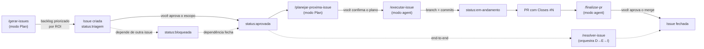

# Fluxo de issues e prompts

Este guia agrega **todo o ciclo de vida de uma issue** e mostra **qual prompt usar em cada etapa**.
É a fonte da verdade do workflow; os prompts individuais cuidam de um passo cada.

> Stack e convenções gerais: [AGENTS.md](../../AGENTS.md) e [copilot-instructions.md](../copilot-instructions.md).

## Visão geral

Os prompts em `.github/prompts/` se dividem em **três grupos**:

| Grupo | Prompts | Para quê |
|-------|---------|----------|
| **Ciclo de vida da issue** | [`gerar-issues`](gerar-issues.prompt.md) → [`planejar-proxima-issue`](planejar-proxima-issue.prompt.md) → [`executar-issue`](executar-issue.prompt.md) → [`finalizar-pr`](finalizar-pr.prompt.md) | Descobrir, planejar, implementar e **fechar** (review + merge) trabalho rastreado por issue. |
| **Orquestrador** | [`resolver-issue`](resolver-issue.prompt.md) | Encadeia planejar → executar → finalizar **uma issue do começo ao fim**, parando só nos pontos de decisão. |
| **Atalhos de scaffolding** | [`nova-pagina`](nova-pagina.prompt.md) · [`novo-calculo`](novo-calculo.prompt.md) · [`novo-componente`](novo-componente.prompt.md) | Gerar código no padrão da codebase **dentro** de uma execução. Não são etapas do fluxo; são ferramentas. |

## O ciclo de vida (passo a passo)



1. **Descobrir / gerar backlog — [`/gerar-issues`](gerar-issues.prompt.md)** (modo Plan, não edita código)
   Varre o app por todas as frentes, evita duplicação contra issues abertas/fechadas e propõe um backlog priorizado por ROI. As issues nascem com **`status:triagem`**.

2. **Aprovar** (você) — ver [Como aprovar uma issue](#como-aprovar-uma-issue) abaixo. Troca `status:triagem` → **`status:aprovada`**.

3. **Planejar — [`/planejar-proxima-issue`](planejar-proxima-issue.prompt.md)** (modo Plan)
   Desempacota uma issue **aprovada** em um plano técnico (arquivos, funções, tarefas verificáveis) e pede sua confirmação. Só libera para a execução após seu "ok".

4. **Executar — [`/executar-issue`](executar-issue.prompt.md)** (modo agent)
   Implementa o escopo aprovado: cria o branch `<type>/<N>-<resumo>`, commita, valida `npm run build` + `npm run lint` e prepara o PR com `Closes #N`. Marca a issue como **`status:em-andamento`**. Durante a execução, pode usar os atalhos de scaffolding.

5. **Finalizar — [`/finalizar-pr`](finalizar-pr.prompt.md)** (modo agent)
   Fecha o PR: lê os **review comments do GitHub Copilot**, resolve os óbvios (pergunta nos duvidosos), revalida `build`/`lint`, faz **rebase** em `main` e resolve conflitos. **Pausa e espera seu "ok"** antes do **squash merge** + `--delete-branch`. O `Closes #N` fecha a issue.

## Gate de revisão do Copilot (obrigatório)

Para evitar merge precoce antes dos comments automáticos chegarem:

1. Após abrir/atualizar PR, aguarde o CI principal concluir.
2. Faça checagens cíclicas de review/comments do Copilot (ex.: a cada 2 minutos) por até **20 minutos** após o último push relevante.
3. Se surgirem comments, trate-os e só avance quando houver breve período sem novidades (ex.: 3 minutos).
4. Se não surgir nenhum comment no prazo, **pause e peça decisão explícita** para seguir sem review do Copilot naquela rodada.

Sem esse gate, o merge não deve acontecer.

> **Atalho end-to-end — [`/resolver-issue`](resolver-issue.prompt.md)** (modo agent): encadeia **planejar → executar → finalizar** uma issue de uma vez, parando só em 3 pontos de decisão (confirmar plano · comments duvidosos · aprovar merge). Aceita um número ou `próxima` (pega a mais prioritária `status:aprovada`). Use quando quiser tocar a issue inteira sem disparar cada prompt na mão.

## Sistema de labels (a ordem de execução)

As labels respondem **"o que fazer a seguir e em que sequência"**. Cada issue carrega 4 eixos + status:

| Eixo | Labels | Significado |
|------|--------|-------------|
| **Tipo** | `bug` · `enhancement` · `documentation` · `tech-debt` | O que é. |
| **Área** | `security` · `infra` · `backend` · `performance` · `ux` | Onde mexe (frontend/dashboards/dx ficam no campo "Frente" da issue). |
| **Prioridade** | `p0` · `p1` · `p2` · `p3` | **Dirige a ordem.** `p0` = segurança/perda de dados (faz primeiro). |
| **Esforço** | `esforco:p` · `esforco:m` · `esforco:g` | Tamanho. Dentro da mesma prioridade, prefira `esforco:p` (quick wins). |
| **Status** | `status:triagem` · `status:aprovada` · `status:bloqueada` · `status:em-andamento` | Estado no fluxo / porta de aprovação. |

`fase-0…3` é reservado a **épicos de roadmap** (ex.: sincronização offline-first = `fase-3`), não a cada bug pequeno.

**Regra prática de ordem:** pegue a issue de **menor `p`** com **`status:aprovada`**; empate de prioridade desempata pelo menor `esforco`. Issues `status:bloqueada` saem da fila até a dependência (`Depende de: #N`) fechar.

### Como achar a próxima issue

```bash
# Próximas aprovadas, mais prioritárias primeiro:
gh issue list --state open --label status:aprovada --search "sort:created-asc"

# Só os p0 prontos para começar:
gh issue list --state open --label status:aprovada --label p0
```

## Como aprovar uma issue

"Aprovar" = sinalizar que **o escopo está claro e a issue pode ser implementada**. É explícito via label:

- **Aprovar:** trocar `status:triagem` por **`status:aprovada`**.
  - Pela UI do GitHub: remova a label `status:triagem` e adicione `status:aprovada`.
  - Pelo CLI:
    ```bash
    gh issue edit <N> --add-label status:aprovada --remove-label status:triagem
    ```
- **Bloquear** (depende de outra): `gh issue edit <N> --add-label status:bloqueada --remove-label status:aprovada` e cite `Depende de: #M` no corpo.
- **Em andamento:** ao abrir o branch/PR, `gh issue edit <N> --add-label status:em-andamento --remove-label status:aprovada`.

> Só issues `status:aprovada` devem entrar em `/planejar-proxima-issue` e `/executar-issue`. Isso evita implementar algo cujo escopo ainda está em discussão.

## Atalhos de scaffolding

Use **durante** a execução de uma issue, quando o trabalho casar com um padrão da codebase:

- [`/nova-pagina`](nova-pagina.prompt.md) — nova aba/página seguindo o padrão de navegação do `App.tsx`.
- [`/novo-calculo`](novo-calculo.prompt.md) — nova função pura em `apps/web/src/utils/powerlifting.ts`.
- [`/novo-componente`](novo-componente.prompt.md) — novo componente React no design system ONYX.
