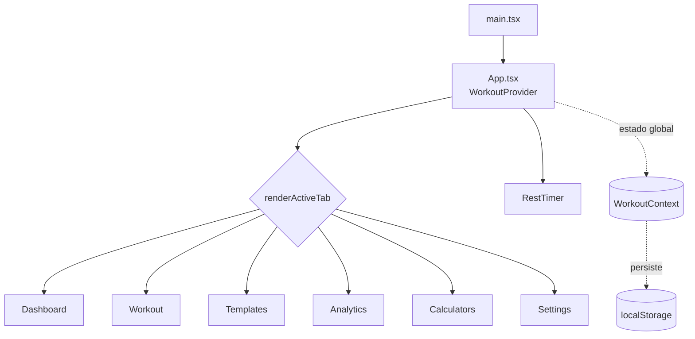

# 🏋️ Powerlifting App

Aplicativo **mobile-first** para acompanhamento de treinos de powerlifting: registre sessões, siga rotinas (templates), calcule e1RM por RPE, monte a barra com anilhas e acompanhe sua evolução com pontuações Wilks, DOTS e IPF GL.

Toda a aplicação roda **100% no navegador** (client-side), sem backend. Os dados são persistidos em `localStorage` e podem ser exportados/importados via JSON.

> **Status:** projeto pessoal em desenvolvimento. A interface está em português (pt-BR).

---

## ✨ Funcionalidades

- **Início (Dashboard):** melhores marcas (e1RM) de Agachamento, Supino e Terra, pontuação DOTS/Wilks, histórico de sessões e tonelagem.
- **Treinar (Workout):** sessão ativa com adição de exercícios e séries, registro de peso/reps/RPE, marcação de conclusão e calculadora de anilhas embutida.
- **Rotinas (Templates):** templates embutidos (LP Iniciante, Madcow 5x5, Wendler 5/3/1) + criação de rotinas próprias; iniciar treino a partir de um template.
- **Análises (Analytics):** evolução do e1RM ao longo do tempo para os três levantamentos principais.
- **Calculadoras (Calculators):** cálculo/visualização de anilhas na barra e cálculo de pontuações (Wilks, DOTS, IPF GL).
- **Configurações (Settings):** unidades (kg/lbs), peso da barra, peso corporal, gênero, status equipado, inventário de anilhas e backup/restauração em JSON.

---

## 🧰 Stack

| Camada | Tecnologia |
|--------|-----------|
| UI | React 19 + TypeScript (strict) |
| Build | Vite 8 (`@vitejs/plugin-react`) |
| Ícones | lucide-react |
| Lint | ESLint 10 (flat config) + typescript-eslint + react-hooks |
| Estilo | CSS puro (`src/index.css`), tema "Chalk & Onyx" |
| Persistência | `localStorage` (sem backend) |
| Deploy | Docker (multi-stage) + `serve` |

> **Sem framework de testes** configurado no momento.

---

## 🚀 Começando

Pré-requisitos: **Node.js 20+** e npm.

```bash
# Instalar dependências
npm install

# Servidor de desenvolvimento (HMR)
npm run dev

# Build de produção (type-check + bundle)
npm run build

# Pré-visualizar o build localmente
npm run preview

# Lint
npm run lint
```

### Scripts disponíveis

| Script | Descrição |
|--------|-----------|
| `npm run dev` | Sobe o Vite com hot module replacement. |
| `npm run build` | Roda `tsc -b` (type-check) e gera o bundle em `dist/`. |
| `npm run preview` | Serve o build de produção localmente. |
| `npm run lint` | Verifica qualidade do código com ESLint. |

---

## 🐳 Docker

A aplicação tem um build multi-stage que gera os estáticos e os serve com `serve` na porta **3000**.

```bash
# Build + subir o container
docker compose up --build

# App disponível em http://localhost:3000
```

Ou diretamente com Docker:

```bash
docker build -t powerlifting-app .
docker run -p 3000:3000 powerlifting-app
```

---

## 🏗️ Arquitetura

A navegação é baseada em **abas** (não usa React Router). O componente raiz alterna entre as páginas via um `switch` em `renderActiveTab()` e uma barra de navegação inferior.



### Estado global — `WorkoutContext`

Todo o estado da aplicação vive em [src/context/WorkoutContext.tsx](src/context/WorkoutContext.tsx) e é exposto via o hook `useWorkout()`. Ele gerencia:

- `state: AppState` — histórico, templates e configurações.
- `activeWorkout` — sessão de treino em andamento.
- Cronômetro de descanso (`restTimerEnd`, `restTimerDuration`).

Funções principais: `startWorkout`, `cancelWorkout`, `completeActiveWorkout`, `addExerciseToActiveWorkout`, `addSetToExercise`, `updateSet`, `saveTemplate`, `deleteTemplate`, `updateSettings`, `getMaxE1RM`, `exportData`, `importData`, `startRestTimer`, `stopRestTimer`.

### Persistência (localStorage)

| Chave | Conteúdo |
|-------|----------|
| `powerlifting_app_state` | Estado completo (histórico, templates, settings). |
| `powerlifting_active_workout` | Sessão de treino ativa. |
| `powerlifting_rest_timer_end` | Timestamp de término do cronômetro de descanso. |

Backup manual via **exportar/importar JSON** na página de Configurações.

> ⚠️ Os dados são locais ao navegador. Limpar o `localStorage` apaga tudo. Não há sincronização em nuvem nem entre dispositivos.

### Cálculos de powerlifting

Funções puras em [src/utils/powerlifting.ts](src/utils/powerlifting.ts):

- `calculateE1RM(weight, reps, rpe?)` — e1RM via tabela RPE da RTS (Mike Tuchscherer); fallback para Brzycki sem RPE.
- `calculateWilks(bodyweight, total, isMale)` — coeficiente Wilks clássico.
- `calculateDots(bodyweight, total, isMale)` — pontuação DOTS.
- `calculateIpfGl(bodyweight, total, isMale, isEquipped?)` — pontos IPF GL (raw/equipado).
- `calculatePlates(targetWeight, barWeight, availablePlates)` — algoritmo guloso para montar anilhas por lado.

---

## 📁 Estrutura de pastas

```text
src/
  App.tsx                  # Shell + navegação por abas
  main.tsx                 # Entry point (monta o React)
  index.css                # Tema "Chalk & Onyx" (CSS puro)
  components/
    PlateVisualizer.tsx    # Barra visual com anilhas (cores IPF)
    RestTimer.tsx          # Cronômetro de descanso flutuante (Web Audio API)
  context/
    WorkoutContext.tsx     # Estado global + persistência localStorage
  pages/
    Dashboard.tsx          # Início
    Workout.tsx            # Sessão de treino ativa
    Templates.tsx          # Rotinas (built-in + customizadas)
    Analytics.tsx          # Gráficos de evolução
    Calculators.tsx        # Anilhas + pontuações
    Settings.tsx           # Preferências + backup
  types/
    workout.ts             # Interfaces de domínio
  utils/
    powerlifting.ts        # Cálculos puros (e1RM, Wilks, DOTS, IPF GL, anilhas)
```

---

## 🎨 Design system — "Chalk & Onyx"

- Tema escuro, layout travado em `--max-width: 480px` (mobile-first, centralizado no desktop).
- Fontes: **Outfit** (títulos) e **Plus Jakarta Sans** (corpo), via Google Fonts.
- Tokens de cor e espaçamento definidos como CSS variables em [src/index.css](src/index.css).

Detalhes completos e convenções estão em [AGENTS.md](AGENTS.md).

---

## 🤝 Contribuindo / desenvolvendo com IA

Este repositório inclui customizações para agentes de codificação (GitHub Copilot e compatíveis):

- [AGENTS.md](AGENTS.md) — convenções de código e arquitetura.
- `.github/copilot-instructions.md` — instruções sempre ativas para o Copilot.
- `.github/prompts/` — prompts reutilizáveis (nova página, novo cálculo, novo componente).
- `.github/agents/powerlifting-dev.agent.md` — agente especializado nesta codebase.
- `.github/skills/` — conhecimento de domínio (fórmulas de powerlifting, design system).

---

## 📄 Licença

Projeto pessoal. Sem licença definida no momento.
