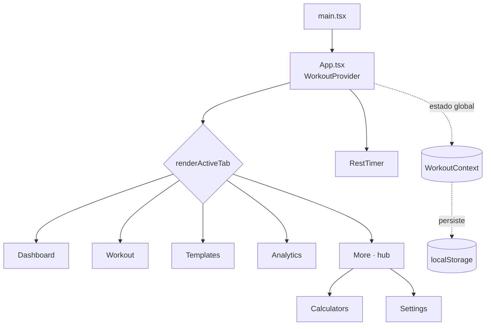

# 🏋️ Powerlifting App

Aplicativo **mobile-first** para acompanhamento de treinos de powerlifting: registre sessões, siga rotinas (templates), calcule e1RM por RPE, monte a barra com anilhas e acompanhe sua evolução com pontuações Wilks, DOTS e IPF GL.

O projeto é um **monorepo** (npm workspaces): o frontend (`apps/web`) é **client-side** com estado em `localStorage`; a API (`apps/api`) é um servidor Fastify + PostgreSQL introduzido de forma incremental.

> **Status:** projeto pessoal em desenvolvimento. A interface está em português (pt-BR). Setup de produção: [docs/deploy-vps.md](docs/deploy-vps.md).

---

## ✨ Funcionalidades

- **Início (Dashboard):** melhores marcas (e1RM) de Agachamento, Supino e Terra, pontuação DOTS/Wilks, histórico de sessões e tonelagem.
- **Treinar (Workout):** sessão ativa com adição de exercícios e séries, registro de peso/reps/RPE, marcação de conclusão e calculadora de anilhas embutida.
- **Rotinas (Templates):** templates embutidos (LP Iniciante, Madcow 5x5, Wendler 5/3/1) + criação de rotinas próprias; iniciar treino a partir de um template.
- **Análises (Analytics):** dashboard a partir do histórico real — evolução de e1RM (SBD), tonelagem por sessão, distribuição de RPE, DOTS/Wilks, heatmap de frequência e linha do tempo de recordes, com filtro de período.
- **Calculadoras (Calculators):** cálculo/visualização de anilhas na barra e cálculo de pontuações (Wilks, DOTS, IPF GL).
- **Configurações (Settings):** **tema de acento (Onyx · Brass · Volt)**, unidades (kg/lbs), peso da barra, peso corporal, gênero, status equipado, inventário de anilhas e backup/restauração em JSON.
- **Mais (More):** hub que agrupa **Calculadoras** e **Configurações**, mantendo a navegação inferior com 4 botões + FAB central (Início · Rotinas · **[+ Treinar]** · Análises · Mais).

---

## 🧰 Stack

| Camada | Tecnologia |
|--------|-----------|
| UI | React 19 + TypeScript (strict) |
| Build | Vite 8 (`@vitejs/plugin-react`) |
| Ícones | lucide-react |
| Lint | ESLint 10 (flat config) + typescript-eslint + react-hooks |
| Testes | Vitest 4 (funções puras em `utils/powerlifting.ts`) |
| Estilo | CSS puro (`apps/web/src/index.css`), design system **ONYX** com temas de acento (Onyx · Brass · Volt) |
| Persistência | `localStorage` (frontend client-side; sincronização com a API prevista na fase 3) |
| Backend | Fastify 5 + PostgreSQL 16 + Drizzle ORM + `@fastify/jwt` |
| Deploy | Docker (multi-stage) + Nginx (non-root, porta 8080) |
| CI/CD | GitHub Actions (lint → testes → build → deploy Dokploy → smoke test) |

---

## 🚀 Começando

Pré-requisitos: **Node.js 20+** e npm.

```bash
# Instalar dependências
npm install

# Servidor de desenvolvimento (HMR)
npm run dev

# Build de produção (type-check + bundle)
npm run build

# Pré-visualizar o build localmente
npm run preview

# Lint
npm run lint

# Testes unitários
npm run test
```

### Scripts disponíveis

| Script | Descrição |
|--------|-----------|
| `npm run dev` | Sobe o Vite com hot module replacement. |
| `npm run build` | Roda `tsc -b` (type-check) e gera o bundle em `apps/web/dist/`. |
| `npm run preview` | Serve o build de produção localmente. |
| `npm run lint` | Verifica qualidade do código do web com ESLint. |
| `npm run test` | Roda os testes unitários com Vitest (modo `run`). |
| `npm run dev:api` | Dev server da API com hot-reload (`tsx watch`). |
| `npm run build:api` | Compila a API TypeScript para `apps/api/dist/`. |
| `npm run lint:api` | ESLint da API. |
| `npm run start:api` | Inicia o servidor compilado da API. |

---

## ⚙️ CI/CD

O pipeline roda automaticamente via **GitHub Actions** em dois contextos:

| Workflow | Gatilho | Etapas |
|---|---|---|
| **CI** ([ci.yml](.github/workflows/ci.yml)) | Pull Requests para `main` | lint → testes → build |
| **Deploy** ([deploy.yml](.github/workflows/deploy.yml)) | Push na `main` | lint → testes → build → deploy Dokploy → smoke test → e-mail |

O deploy só é acionado **após o gate de qualidade passar** (lint + testes + build). Código quebrado nunca chega em produção. Ao final de cada deploy, um e-mail de resumo é enviado com o status de cada etapa e link para os logs no GitHub Actions.

### Secrets necessários (GitHub → Settings → Secrets → Actions)

| Secret | Valor |
|---|---|
| `DOKPLOY_API_KEY` | API key do painel Dokploy (Settings → API) |
| `DOKPLOY_APP_ID_WEB` | `applicationId` do serviço web no Dokploy |
| `DOKPLOY_APP_ID_API` | `applicationId` do serviço api no Dokploy |
| `APP_URL` | URL pública do frontend (para smoke test) |
| `API_URL` | URL pública da API (para smoke test) |
| `RESEND_API_KEY` | API key gerada em resend.com |
| `MAIL_TO` | E-mail destinatário do resumo |

> E-mails enviados via [Resend](https://resend.com) (gratuito, 100 e-mails/dia). O deploy usa o **runner self-hosted** `dokploy-vps` instalado no VPS — veja [docs/deploy-vps.md](docs/deploy-vps.md) para o setup completo.

---

## 🐳 Docker (desenvolvimento local)

O stack local sobe **web + API + PostgreSQL** via `docker compose`. Os serviços usam `expose` (não publicam portas no host); o acesso externo é via Traefik em produção. Para expor localmente, adicione `ports:` no `docker-compose.yml` conforme necessário.

```bash
# Build + subir todo o stack
docker compose up --build
```

Copie `.env.example` para `.env` e ajuste as variáveis antes de subir. A API aplica as migrations automaticamente no boot. Para produção, veja [docs/deploy-vps.md](docs/deploy-vps.md).

---

## 🏗️ Arquitetura

A navegação é baseada em **abas** (não usa React Router). O componente raiz alterna entre as páginas via um `switch` em `renderActiveTab()` e uma barra de navegação inferior com **4 botões + um FAB central** (Início · Rotinas · **[+ Treinar]** · Análises · Mais). Apenas Calculadoras e Configurações vivem dentro do hub **Mais**.



### Estado global — `WorkoutContext`

Todo o estado da aplicação vive em [apps/web/src/context/WorkoutContext.tsx](apps/web/src/context/WorkoutContext.tsx) e é exposto via o hook `useWorkout()`. Ele gerencia:

- `state: AppState` — histórico, templates e configurações.
- `activeWorkout` — sessão de treino em andamento.
- Cronômetro de descanso (`restTimerEnd`, `restTimerDuration`).

Funções principais: `startWorkout`, `cancelWorkout`, `completeActiveWorkout`, `addExerciseToActiveWorkout`, `addSetToExercise`, `updateSet`, `saveTemplate`, `deleteTemplate`, `updateSettings`, `getMaxE1RM`, `exportData`, `importData`, `startRestTimer`, `stopRestTimer`.

### Persistência (localStorage)

| Chave | Conteúdo |
|-------|----------|
| `powerlifting_app_state` | Estado completo (histórico, templates, settings). |
| `powerlifting_active_workout` | Sessão de treino ativa. |
| `powerlifting_rest_timer_end` | Timestamp de término do cronômetro de descanso. |

Backup manual via **exportar/importar JSON** na página de Configurações.

> ⚠️ Os dados são locais ao navegador. Limpar o `localStorage` apaga tudo. Não há sincronização em nuvem nem entre dispositivos.

### Cálculos de powerlifting

Funções puras em [apps/web/src/utils/powerlifting.ts](apps/web/src/utils/powerlifting.ts):

- `calculateE1RM(weight, reps, rpe?)` — e1RM via tabela RPE da RTS (Mike Tuchscherer); fallback para Brzycki sem RPE.
- `calculateWilks(bodyweight, total, isMale)` — coeficiente Wilks clássico.
- `calculateDots(bodyweight, total, isMale)` — pontuação DOTS.
- `calculateIpfGl(bodyweight, total, isMale, isEquipped?)` — pontos IPF GL (raw/equipado).
- `calculatePlates(targetWeight, barWeight, availablePlates)` — algoritmo guloso para montar anilhas por lado.

---

## 📁 Estrutura de pastas

O projeto é um **monorepo** com npm workspaces.

```text
powerlifting-app/
  apps/
    web/                     # Frontend React (Vite)
      index.html
      vite.config.ts
      pwa-assets.config.ts
      tsconfig*.json
      eslint.config.js
      public/               # Marca ONYX: favicon.svg, pwa-*.png, maskable, apple-touch, logo.svg, mark.svg
      src/
        App.tsx              # Shell + navegação por abas
        main.tsx             # Entry point (monta o React)
        index.css            # Design system ONYX (CSS puro)
        components/
          PlateVisualizer.tsx # Barra visual com anilhas (cores IPF)
          RestTimer.tsx       # Cronômetro de descanso flutuante (Web Audio API)
        context/
          WorkoutContext.tsx  # Estado global + persistência localStorage
        pages/
          Dashboard.tsx       # Início
          Workout.tsx         # Sessão de treino ativa
          Templates.tsx       # Rotinas (built-in + customizadas)
          Analytics.tsx       # Gráficos de evolução
          Calculators.tsx     # Anilhas + pontuações
          Settings.tsx        # Preferências + backup
          More.tsx            # Hub "Mais" (Análises · Calculadoras · Configurações)
        utils/
          powerlifting.ts     # Cálculos puros (e1RM, Wilks, DOTS, IPF GL, anilhas)
  packages/
    shared/                  # Tipos de domínio compartilhados (@powerlifting/shared)
      src/
        workout.ts           # Interfaces de domínio
        index.ts             # Barrel de exportação
  package.json               # Raiz: npm workspaces + scripts que delegam
```

---

## 🎨 Design system — ONYX

- Tema escuro, layout travado em `--max-width: 480px` (mobile-first, centralizado no desktop).
- Fontes: **Outfit** (títulos e números) e **Plus Jakarta Sans** (corpo), via Google Fonts.
- Tokens de cor, raio e transição definidos como CSS variables em [apps/web/src/index.css](apps/web/src/index.css).

### Tema de acento (Onyx · Brass · Volt)

A cor de destaque é uma **única** variável `--accent` (com `--accent-soft`, `--accent-border` e `--accent-ink`). Trocar de tema é só mudar o atributo `data-theme` no `<html>`:

| Tema | `--accent` | Caráter |
|---|---|---|
| **Brass** (padrão) | `#e3a83b` | dourado de anilha |
| **Onyx** | `#fafafa` | monocromático |
| **Volt** | `#b6e34a` | elétrico |

Escolhido em **Configurações → Aparência**, persistido em `settings.theme` e aplicado pelo `WorkoutContext` no `<html>`. Use sempre `var(--accent)` / `var(--accent-ink)` para destaques — não hardcode `#ffffff`/`#000000`.

### Marca

Wordmark **ONYX** (Outfit 900) + a marca: uma **anilha vista de frente** (anel dourado). Ícones do PWA em [apps/web/public/](apps/web/public/) — `favicon.svg` é a fonte vetorial; `pwa-*.png`, `maskable-icon-512x512.png` e `apple-touch-icon-180x180.png` formam o set instalável; `logo.svg`/`mark.svg` para uso em tela.

Detalhes completos e convenções estão em [AGENTS.md](AGENTS.md).

---

## 🤝 Contribuindo / desenvolvendo com IA

Este repositório inclui customizações para agentes de codificação (GitHub Copilot e compatíveis):

- [AGENTS.md](AGENTS.md) — convenções de código e arquitetura.
- `.github/copilot-instructions.md` — instruções sempre ativas para o Copilot.
- `.github/prompts/` — prompts reutilizáveis (nova página, novo cálculo, novo componente).
- `.github/agents/powerlifting-dev.agent.md` — agente especializado nesta codebase.
- `.github/skills/` — conhecimento de domínio (fórmulas de powerlifting, design system).

---

## 📄 Licença

Projeto pessoal. Sem licença definida no momento.
